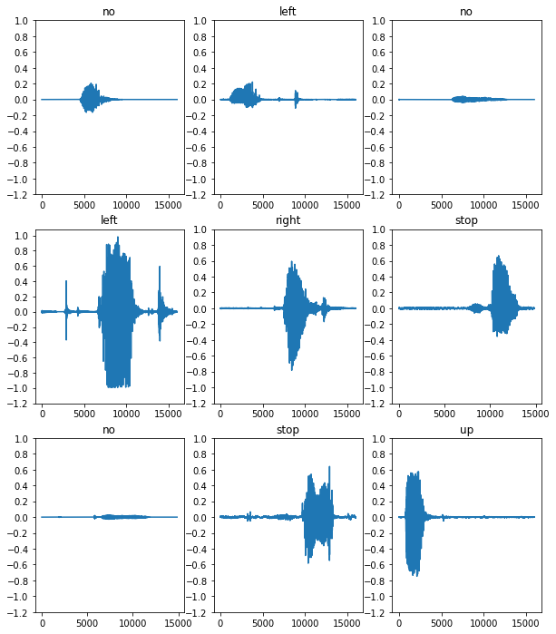
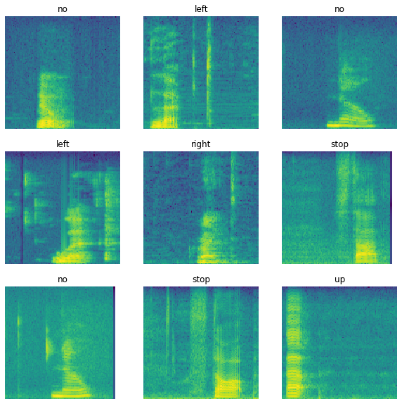
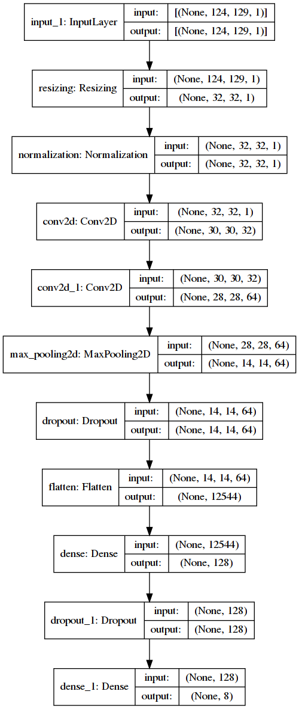

This repo was bootstrapped by leveraging the [Machine Learning Project Template](https://github.com/wavelike/ml_project_template), which helps with a fast project setup while applying best practices from Software and ML Engineering and providing predefined methods for deploying the model in production and supporting MLOps tasks.

# Speech Command - from training to deployment

The aim of this project is to build and deploy a speech recognition model that is able to recognise the following set of keywords:
 "down", "go", "left", "no", "right", "stop", "up" and "yes". 
This is heavily based on Google's [*Simple audio recognition: Recognizing keywords*](https://www.tensorflow.org/tutorials/audio/simple_audio) tutorial, embedding the steps from the notebook into the [ml_project_template](https://github.com/wavelike/ml_project_template) structure and adding deployment options.
 
Recognising single words is useful e.g. for wake word applications where a lightweight model is needed to constantly evaluate whether a specific wake word was communicated in order to activate a device or an app.

A limited set of command keywords can also be used to navigate across applications in a hands-free mode.

## Speech Command dataset

The dataset is provided by Google and contains 105,000 WAV audio files of people saying one of the above keywords.
The sampling rate of the audio signal is 16kHz (16k signals per second).

Link: http://storage.googleapis.com/download.tensorflow.org/data/mini_speech_commands.zip

## Data Preprocessing

The audio files are converted to numerical tensors representing the audio signals' amplitude as a time series of a time range of up to one second.

As the audio files are rather short and contain just one keyword, a smart approach for modelling is the conversion of the signal into 
the frequency domain and applying an image classification neural network on it, as opposed to doing complex signal preprocessing or adopting a sequence model (which would be necessary if we wanted to recognise a sequence of tokens, as e.g. in a spoken sentence).

In order to obtain the frequency representation, a Fourier Transformation can be applied. A downside of this approach is that all time-dependency would be lost as we enter the frequency domain, which would be ok if we just wanted to recognise a homogenous sound (like an A note for example), but for a spoken word time dependency is crucial information.
Therefore, the waveform time series is split into multiple windows and for each window a Fourier Transformation is applied, resulting in a spectrogram that gives us the frequency distribution over time. This method is called *short-time Fourier Transformation (STFT)*.
The samples created through this transformation have two dimensions (one time dimension, one frequency dimension) and can be processed by a *convolutional neural network (CNN)*.

Here some examples of spectrograms:

## Convolutional Neural Network

The input to the network are the spectrogram samples, which are resized to a smaller size in the first layer in order to speed up processing time.
Also the input is normalised based on the training datasets' statistics. 
After follows a classical CNN architecture of two convolutional layers that create 32 and 64 feature maps respectively, and a max_pooling layer that reduces the spatial size.
Then a dropout layer is applied to prevent overfitting and the data is flattened in order to be passed to a dense layer with dropout that eventually outputs eight logits, one for each keyword to be predicted.

## Deployment

The serialised model artifacts together with the preprocessing and prediction pipeline can be deployed to Google App Engine:

- project preparation: 
    - `bash executables/cloud_setup.sh` with `cloud_provider='google_app_engine'`
- the relevant files for deployment are present under the project root:
    - main.py: entrypoint
    - requirements.txt: for dependencies (does not support pipfile)
    - .gcloudignore: Which files not to upload
    - app.yaml: App definition, e.g. the python version
- deploy code via `gcloud app deploy` (assuming the app is created already)

After deployment, audio data can be sent to the API and the predicted keyword is returned.
Test this via `deployment/tests/test_prediction_service_app_engine.py` 
